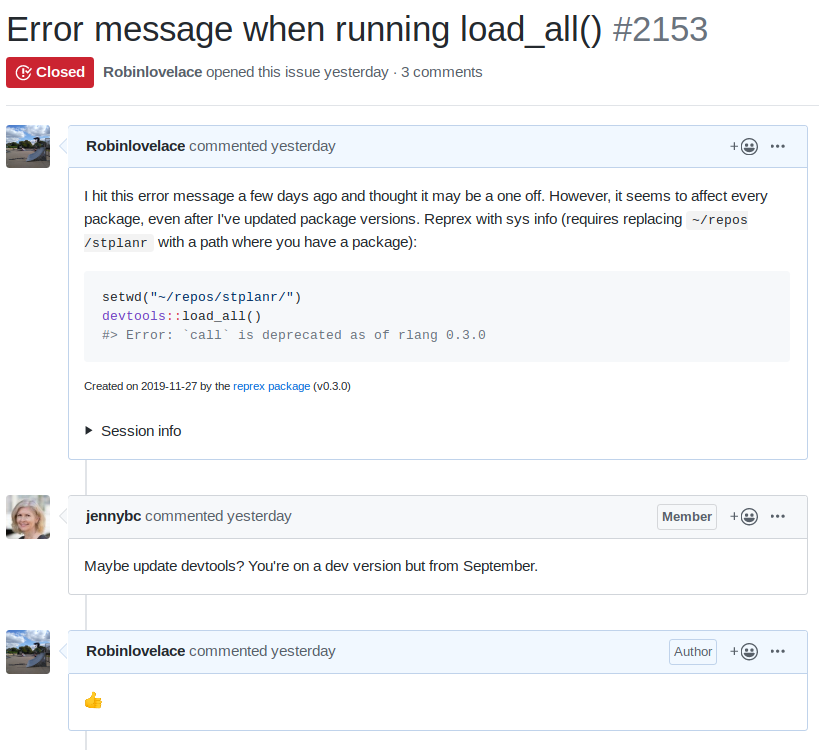
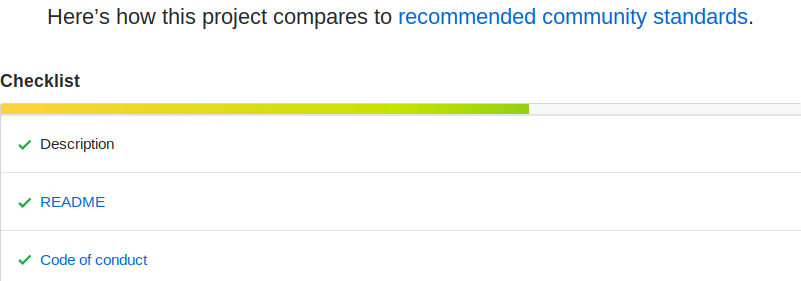

background-image: url(https://hips.hearstapps.com/hmg-prod.s3.amazonaws.com/images/gh-self-help-books-1551713371.png)

--

```{r, eval=FALSE}
# to reproduce these slides do:
pkgs = c("rgdal", "sf", "geojsonsf")
install.packages(pkgs)
```

--


```{r setup, include=FALSE}
options(htmltools.dir.version = FALSE)
```

--

## Source [goodhousekeeping.com](https://www.goodhousekeeping.com/life/entertainment/g26588504/best-self-help-books/)

--

The Best Self-Help Books to Read in 2019, According to Amazon and Goodreads


???

There are loads of self help books out there

---

background-image: url(https://images-na.ssl-images-amazon.com/images/I/41R3etYqvBL._SX326_BO1,204,203,200_.jpg)

???

Originally published in 2001, it has gained huge popularity

---

background-image: url(https://images-na.ssl-images-amazon.com/images/I/51inoqTDRML._SX379_BO1,204,203,200_.jpg)

???

2008 book by Scott Burkun aimed at software architects

Too techy for me, about managing 100s of people!

---

background-image: url(https://images-na.ssl-images-amazon.com/images/I/414PFUnar-L._SX324_BO1,204,203,200_.jpg)

???

2015 book by Daniel Levitin

Too techy for me, about managing 100s of people!

---

.pull-left[

```{r, echo=FALSE}
knitr::include_graphics("https://csgillespie.github.io/efficientR/figures/f0_web.png")
```

]

--

.pull-right[

## Open source book

### Published early 2016

### All the things I wish I knew

### Handy chapters:

#### Efficient set-up

#### Efficient workflow

#### Efficient collaboration

]

---

## From code to impact

```{r, echo=FALSE, out.width="90%"}
knitr::include_graphics("https://raw.githubusercontent.com/npct/pct-team/master/figures/front-page-leeds-pct-demo.png")
```

--

Source - https://github.com/npct which hosts national web tool PCT [www.pct.bike](http://www.pct.bike/)


<!-- background-imag: url(https://i.gr-assets.com/images/S/compressed.photo.goodreads.com/books/1507165449l/36355673._SX318_.jp) -->

???

2017 book by Mark Reed

---

# Types of efficiency

--

.pull-left[

## Programmer efficiency

This is the amount of useful work a person (not a computer) can do per unit time

]

--

.pull-right[

## Computational efficiency

How quickly the computer can undertake a piece of work

]

--

One essential object is to choose that arrangement which shall tend to reduce to a minimum the time necessary for completing the calculation. (Ada Lovelace, [1842](https://csgillespie.github.io/efficientR/introduction.html#ref-lovelace1842translator))

--

An efficient light shines bright with a minimum of energy consumption. In this final sense, efficiency has a formal definition as the ratio of work done per unit effort:

$$
\eta = \frac{W}{Q}
$$

---
class: inverse, center, middle

# Efficient set-up

--

### Based on Efficient R programming [Chapter 2](https://csgillespie.github.io/efficientR/set-up.html)

---

## R and package versions  

.pull-left[

#### Keep your software up-to-date

```{r}
R.version
packageVersion("dplyr")
```

]

--

.pull-left[


### Who cares?



Source: https://github.com/r-lib/devtools/issues/2153

]
---


class: inverse, center, middle

# Efficient workflow

---

<!-- background-imag: url(https://i.pinimg.com/originals/d3/57/8f/d3578fe5d173fa348f8463f7f47b949a.png) -->


## Package selection

.pull-left[

- Is it mature?

- Is it actively developed? 

- Is it well documented? 

- Is it well used? 

]

--

.pull-right[

### Interest in popularity can go too far

<blockquote class="twitter-tweet"><p lang="en" dir="ltr">Everyone is doing it so I might as well join!<br><br>Made a simple bar chart race of package downloads using <a href="https://twitter.com/mbostock?ref_src=twsrc%5Etfw">@mbostock</a>&#39;s template.<a href="https://t.co/lk0U71Xtp4">https://t.co/lk0U71Xtp4</a> <a href="https://twitter.com/hashtag/rstats?src=hash&amp;ref_src=twsrc%5Etfw">#rstats</a> <a href="https://t.co/qGmHohFxif">pic.twitter.com/qGmHohFxif</a></p>&mdash; Emil Hvitfeldt (@Emil_Hvitfeldt) <a href="https://twitter.com/Emil_Hvitfeldt/status/1194785416689287169?ref_src=twsrc%5Etfw">November 14, 2019</a></blockquote> <script async src="https://platform.twitter.com/widgets.js" charset="utf-8"></script> 

]

--

See Efficient R Programming [4.4](https://csgillespie.github.io/efficientR/workflow.html#package-selection) for details

---

## Benchmarking your code

```{r, message=FALSE}
# 3 ways to read in files representing parks in Leeds
rds = function() readRDS("parks-west-yorkshire.Rds")
rgd = function() rgdal::readOGR(dsn = "parks-west-yorkshire.geojson", verbose = FALSE)
sfr = function() sf::read_sf("parks-west-yorkshire.geojson")
gsf = function() geojsonsf::geojson_sf("parks-west-yorkshire.geojson")

res = bench::mark(check = F, rds(), rgd(), sfr(), gsf(), time_unit = "ms")
res[1:5]
```

--

Which to use?

--

Package/data format choice -> 200 fold speed-up!

--

Rds fast + mem efficient, 'gsf' fast, memory hungry, sf slow but ubiquitous, rgdal ...

--

For reproducible code, see https://github.com/Robinlovelace/EfficientWorkflows

---

## Benchmark + check results

```{r, message=FALSE, fig.width=9, fig.height=5, out.width="100%"}
plot(res)
```

---

## Always check your results

```{r}
# see https://geocompr.robinlovelace.net/adv-map.html to learn  how to make more maps
mapview::mapview(gsf()) # the parks of West Yorkshire
```

---

## Other things R can do

.pull-left[

In addition to uneatable statistical capabilities

### R is also good at...

- Report/book/presentation making

- Image manipulation with the magick package - see [ropensci/magick](https://github.com/ropensci/magick)

- Map making - see [geocompr.robinlovelace.net/](https://geocompr.robinlovelace.net/)

- Emailing (!) - see [rich-iannone/blastula](https://github.com/rich-iannone/blastula) 


(again it can go too far)
]

--

.pull-right[

### Example: [citr](https://github.com/crsh/citr)


]

---

## Going too far


Source: https://xkcd.com/1205/


---

class: inverse, center, middle

# Efficient collaboration

---

## Dozens of technologies to collaborate

--

But it's all about people


---

# Community

<blockquote class="twitter-tweet"><p lang="en" dir="ltr">Probably the most productivity-improving thing you do can for a data science team is to create and maintain a strong, inclusive community of practice. If people on your team aren’t constantly learning from each other, you’re leaving a ton of value on the table.</p>&mdash; Sean J. Taylor (@seanjtaylor) <a href="https://twitter.com/seanjtaylor/status/1197964523237335040?ref_src=twsrc%5Etfw">November 22, 2019</a></blockquote> <script async src="https://platform.twitter.com/widgets.js" charset="utf-8"></script> 

### Community tips ([Geocomputation with R](https://github.com/Robinlovelace/geocompr/community))


---

# Magic Touch: typing


--

Source - Efficient R Programming [1.5.1](https://csgillespie.github.io/efficientR/introduction.html#touch-typing) 

???

The evidence suggests that good diet, physical activity, plenty of sleep and a healthy work-life balance can all boost your speed and effectiveness at work (Jensen 2011; Pereira et al. 2015; Grant, Wallace, and Spurgeon 2013).

While we recommend the reader to reflect on this evidence and their own well-being, this is not a self help book. It is about programming. However, there is one non-programming skill that can have a huge impact on productivity: touch typing. 

---

class: center, middle

# Thanks!

Contact me at r. lovelace at leeds ac dot uk (email), `@robinlovelace` (twitter + github)

--

Check-out my repos at https://github.com/robinlovelace/

--

For more information on efficient workflows, see our book [*Efficient R Programming*](https://csgillespie.github.io/efficientR/)

--

Thanks to all the R developers who made this possible, including (for this presentation):

[remark.js](https://remarkjs.com), [**knitr**](http://yihui.name/knitr), and [R Markdown](https://rmarkdown.rstudio.com).

Slides created via the R package [**xaringan**](https://github.com/yihui/xaringan).

--

Thanks to everyone for building a open and collaborative communities!
